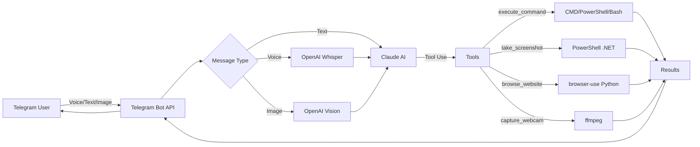

# Claude Code Bot 🤖

> Control your Windows machine remotely via Telegram using natural language, powered by Claude AI and advanced multimodal capabilities.

[](https://opensource.org/licenses/MIT)
[](https://nodejs.org/)
[](https://www.anthropic.com/)

## 🎥 Demo

Watch it in action: **[YouTube Demo](https://www.youtube.com/shorts/SBsAF9SyHyc)** - See voice commands controlling Windows remotely!

## ✨ Features

### 🎯 Core Capabilities
- **Natural Language Control**: Execute Windows commands using conversational language
- **Voice Commands**: Send voice messages that get transcribed and executed automatically
- **Visual Understanding**: Send screenshots or photos for AI-powered OCR and analysis
- **Desktop Screenshots**: Capture and receive desktop screenshots on demand
- **Webcam Capture**: Take photos from your webcam remotely
- **AI Web Browsing**: Autonomous browser agent that can navigate websites, interact with pages, and take screenshots
- **Multi-Shell Support**: Automatically detects and uses CMD, PowerShell, or Git Bash
- **Self-Healing**: Built-in dependency installer that fixes setup issues automatically

### 🔐 Security
- **User Authorization**: Single or multi-user whitelist via Telegram user IDs
- **Input Validation**: Prevents malformed commands that could trigger system errors
- **Auto-Cleanup**: Configurable data retention with automatic old file deletion
- **No GUI Interference**: Smart handling prevents accidental popup dialogs

### 🧠 Intelligence
- **Agentic Behavior**: Claude autonomously chains multiple tools to complete complex tasks
- **Context Tracking**: Remembers files, directories, and previous operations in conversation
- **Extended Thinking**: Optional deep reasoning mode for complex problem-solving
- **Step-by-Step Mode**: Controlled execution with one action per model turn

## 📋 Table of Contents

- [Requirements](#-requirements)
- [Quick Start](#-quick-start)
- [Setup Guide](#-setup-guide)
- [Configuration](#-configuration)
- [Usage Examples](#-usage-examples)
- [Running 24/7](#-running-247)
- [Advanced Features](#-advanced-features)
- [Troubleshooting](#-troubleshooting)
- [Security Warnings](#-security-warnings)
- [Architecture](#-architecture)
- [Contributing](#-contributing)

## 🔧 Requirements

- **Windows 10/11** (required for desktop screenshot and system tools)
- **Node.js 18+** ([Download](https://nodejs.org/))
- **Telegram Account** ([Get Telegram](https://telegram.org/))
- **Anthropic API Key** ([Get API Key](https://console.anthropic.com/))
- **Optional**: OpenAI API Key (for image understanding and voice transcription)
- **Optional**: Python 3.9+ (auto-installed by healer script for browser features)

## 🚀 Quick Start

### 1. Clone the Repository

```bash
git clone https://github.com/ralfs66/claudecode.git
cd claudecode
```

### 2. Install Dependencies

```bash
npm install
```

### 3. Run the Healer (First-Time Setup)

The healer script will:
- Install Node.js, Python, browser-use, Playwright Chromium, and ffmpeg
- Create `config.json` with auto-detected paths
- Set up `.env` from template

```bash
npm run heal
```

Or directly:

```powershell
powershell -ExecutionPolicy Bypass -File .\heal.ps1
```

### 4. Configure API Keys

Edit `.env` file (created by healer) with your credentials:

```env
TELEGRAM_BOT_TOKEN=123456789:ABCdefGHIjklMNOpqrsTUVwxyz
ANTHROPIC_API_KEY=sk-ant-api03-xxxxx
AUTHORIZED_USER_IDS=123456789,987654321
OPENAI_API_KEY=sk-proj-xxxxx  # Optional
```

### 5. Start the Bot

```bash
npm start
```

You're ready! Send a message to your Telegram bot.

## 📝 Setup Guide

### Get Required API Keys

#### 1. Telegram Bot Token
1. Open Telegram and search for [@BotFather](https://t.me/botfather)
2. Send `/newbot` and follow the instructions
3. Save the bot token you receive
4. **Important**: Send `/setprivacy` to BotFather → Select your bot → Choose **Disable** to allow the bot to read all messages

#### 2. Anthropic API Key
1. Visit [console.anthropic.com](https://console.anthropic.com/)
2. Sign up or log in
3. Navigate to **API Keys** section
4. Click **Create Key** and save it

#### 3. Your Telegram User ID
1. Open Telegram and search for [@userinfobot](https://t.me/userinfobot)
2. Send `/start` to get your user ID
3. Save this number (e.g., `123456789`)

#### 4. OpenAI API Key (Optional)
Required for:
- Image understanding (OCR, photo analysis)
- Voice message transcription

1. Visit [platform.openai.com](https://platform.openai.com/)
2. Create an API key
3. Add billing information (pay-as-you-go)

### Configure Secrets

1. **Create `.env` file** (if not created by healer):
   ```bash
   cp .env.example .env
   ```

2. **Edit `.env`** with your credentials:
   ```env
   TELEGRAM_BOT_TOKEN=your_telegram_bot_token
   ANTHROPIC_API_KEY=sk-ant-your_api_key

   # Single user:
   AUTHORIZED_USER_ID=123456789

   # OR multiple users (comma-separated):
   AUTHORIZED_USER_IDS=123456789,987654321

   # Optional (for images + voice):
   OPENAI_API_KEY=sk-proj-your_openai_key
   ```

### Configure Options

Edit `config.json` for non-secret settings:

```json
{
  "dataDir": "./data",
  "stepConfirm": true,
  "maxAgentIterations": 25,
  "deepThinking": false,
  "browserUseLlmProvider": "openai"
}
```

**Key Options**:
- `stepConfirm`: Enable step-by-step mode (one tool call per turn)
- `deepThinking`: Enable Claude's extended thinking mode
- `maxAgentIterations`: Maximum autonomous tool-use loops
- `dataRetentionHours`: Auto-delete files older than N hours
- `browserUseLlmProvider`: `openai` or `anthropic` for web browsing

## ⚙️ Configuration

### Environment Variables (`.env`)

| Variable | Required | Description |
|----------|----------|-------------|
| `TELEGRAM_BOT_TOKEN` | ✅ Yes | Token from @BotFather |
| `ANTHROPIC_API_KEY` | ✅ Yes | Claude API key |
| `AUTHORIZED_USER_IDS` | ✅ Yes | Comma-separated Telegram user IDs |
| `OPENAI_API_KEY` | ⚪ Optional | For images and voice transcription |

### Config Options (`config.json`)

<details>
<summary><strong>View All Options</strong></summary>

| Option | Type | Default | Description |
|--------|------|---------|-------------|
| `dataDir` | String | `"./data"` | Default working directory for files |
| `notesPath` | String | `"notes/notes.txt"` | File for saved notes |
| `stepConfirm` | Boolean | `true` | Execute one tool at a time |
| `maxAgentIterations` | Number | `25` | Max autonomous loops |
| `deepThinking` | Boolean | `false` | Enable extended thinking |
| `thinkingBudgetTokens` | Number | `8000` | Thinking token budget |
| `dataRetentionHours` | Number | `24` | Auto-delete old files |
| `dataCleanupIntervalMinutes` | Number | `60` | Cleanup check interval |
| `stopAfterSuccessfulBrowse` | Boolean | `true` | Stop after successful browse |
| `ffmpegPath` | String | `""` | Path to ffmpeg (auto-detected) |
| `browserUsePython` | String | `"python"` | Python executable |
| `chromePath` | String | `""` | Chrome executable (auto-detected) |
| `browserUseLlmProvider` | String | `"openai"` | `openai` or `anthropic` |
| `browserUseLlmModel` | String | `"gpt-4o"` | Model for browsing |
| `powershellExe` | String | `""` | PowerShell path (auto-detected) |
| `gitBashPath` | String | `""` | Git Bash path (auto-detected) |

</details>

## 💬 Usage Examples

### Basic Commands

```
"list all files in current directory"
"create a file called hello.txt with hello world"
"show me all running processes"
"get system information"
```

### Opening Applications

```
"open calculator"
"open notepad"
"launch chrome"
```

### Screenshots

```
"take a screenshot"
"screenshot"
"show me the desktop"
```

### Web Browsing

```
"browse https://github.com/trending"
"open youtube.com and screenshot the homepage"
"go to reddit.com/r/programming and summarize top posts"
```

### File Operations

```
"create a folder called MyProject on the desktop"
"write a python script to calculate fibonacci numbers"
"find all .txt files in Documents folder"
```

### System Operations

```
"shutdown the computer in 1 hour"
"restart the computer"
"check disk space"
"show network connections"
```

### Voice Commands

1. Record a voice message in Telegram
2. Send it to the bot
3. The bot transcribes it with OpenAI Whisper
4. Claude executes the command
5. You receive the results

Example voice message:
> "Hey bot, take a screenshot and show me what's on my desktop right now"

### Image Understanding

Send a photo with caption:
> "What text is in this image?"

The bot will:
1. Download the image
2. Run OCR with OpenAI Vision
3. Provide Claude with the analysis
4. Respond with extracted text/description

## 🏃 Running 24/7

### Option 1: PM2 (Recommended)

**Install PM2**:
```bash
npm install -g pm2
```

**Start the bot**:
```bash
pm2 start bot.js --name claudecode-bot
pm2 save
pm2 startup
```

**Manage the bot**:
```bash
pm2 status              # Check status
pm2 logs claudecode-bot # View logs
pm2 restart claudecode-bot
pm2 stop claudecode-bot
```

### Option 2: Windows Service

Use [node-windows](https://github.com/coreybutler/node-windows):

```bash
npm install -g node-windows
```

Create `service.js`:
```javascript
const Service = require('node-windows').Service;

const svc = new Service({
  name: 'Claude Code Bot',
  description: 'Telegram bot for Windows control',
  script: require('path').join(__dirname, 'bot.js')
});

svc.on('install', () => svc.start());
svc.install();
```

Run:
```bash
node service.js
```

### Option 3: Task Scheduler

1. Open **Task Scheduler**
2. Create Basic Task → **Start a program**
3. Program: `C:\Program Files\nodejs\node.exe`
4. Arguments: `C:\path\to\claudecode\bot.js`
5. Trigger: **At startup**
6. Run with highest privileges

## 🎨 Advanced Features

### Extended Thinking Mode

Enable deep reasoning for complex tasks:

```json
{
  "deepThinking": true,
  "thinkingBudgetTokens": 16000
}
```

Claude will use internal reasoning before responding (uses more tokens).

### Webcam Capture

```
"take a webcam photo"
"capture a picture from my camera"
```

Requires ffmpeg (auto-installed by healer).

### Browser Automation

The bot uses [browser-use](https://github.com/browser-use/browser-use) for autonomous web browsing:

```
"browse amazon.com and search for laptop stands"
"go to github.com and find trending python projects"
"open reddit.com and screenshot the front page"
```

Options in `config.json`:
```json
{
  "browserUseLlmProvider": "anthropic",
  "browserUseLlmModel": "claude-3-5-sonnet-20240620"
}
```

### Persistent Notes

The bot saves notes to `notes/notes.txt` by default:

```
"remember that my API key expires on Jan 15"
"save this to notes: project deadline is Friday"
"what did I save in my notes?"
```

## 🔍 Troubleshooting

### Bot Not Responding

**Problem**: Bot doesn't reply to messages

**Solutions**:
1. Check bot token: `echo %TELEGRAM_BOT_TOKEN%` (Windows CMD)
2. Verify user ID is in `AUTHORIZED_USER_IDS`
3. Check Node.js is running: `tasklist | findstr node`
4. View logs in console

### Commands Not Executing

**Problem**: Bot receives messages but doesn't run commands

**Solutions**:
1. Verify Anthropic API key: Check [console.anthropic.com](https://console.anthropic.com/)
2. Check API quota/credits
3. Look for error messages in console output

### Unauthorized Error

**Problem**: "Unauthorized user" message

**Solution**: Add your Telegram user ID to `.env`:
```env
AUTHORIZED_USER_IDS=123456789
```

Get your ID from [@userinfobot](https://t.me/userinfobot)

### White/Blank Screenshots

**Problem**: Screenshots are completely white or blank

**Solutions**:
1. **Desktop screenshots**: Run bot from an interactive terminal (not as Windows Service)
2. **Browser screenshots**: Run healer script:
   ```bash
   npm run heal
   ```
3. Enable auto-install in `config.json`:
   ```json
   {
     "autoInstallPlaywrightChromium": true
   }
   ```

### Voice Transcription Fails

**Problem**: "Transcription unavailable" error

**Solutions**:
1. Verify OpenAI API key in `.env`
2. Install ffmpeg:
   ```bash
   npm run heal
   ```
3. Check ffmpeg is in PATH:
   ```cmd
   ffmpeg -version
   ```

### Browse Website Fails

**Problem**: "browser-use not found" or Python errors

**Solution**: Run the healer script:
```bash
npm run heal
```

This installs:
- Python 3.11+
- browser-use package
- Playwright + Chromium

### Migrating to New PC

**Steps**:
1. Copy entire project folder to new PC
2. Run healer script:
   ```bash
   npm run heal
   ```
3. Edit `.env` with your API keys
4. Start bot: `npm start`

The healer will:
- Install all dependencies
- Auto-detect paths (Python, Chrome, ffmpeg)
- Update `config.json`

## 🔒 Security Warnings

### ⚠️ Critical Warnings

This bot allows **unrestricted remote command execution** on your machine. Please understand the risks:

1. **Remote Access**: Anyone with your bot token can control your PC (if authorized)
2. **Arbitrary Code**: Can run any command, script, or program
3. **File System Access**: Full read/write access to your files
4. **Webcam/Screenshots**: Can capture photos and screen content
5. **Browser Sessions**: Can access logged-in accounts via browser automation

### 🛡️ Security Best Practices

**Required**:
- ✅ Keep `.env` file **secret** (never commit to git)
- ✅ Use strong, unique API keys
- ✅ Limit `AUTHORIZED_USER_IDS` to trusted users only
- ✅ Enable 2FA on your Telegram account
- ✅ Regularly rotate API keys

**Recommended**:
- ✅ Run bot with least-privilege Windows user account
- ✅ Monitor command execution logs
- ✅ Set up firewall rules
- ✅ Use separate OpenAI/Anthropic accounts for production
- ✅ Review `data/` folder contents regularly
- ✅ Enable disk encryption (BitLocker)

**Never**:
- ❌ Share your `.env` file
- ❌ Commit API keys to version control
- ❌ Run with Administrator privileges (unless absolutely necessary)
- ❌ Authorize unknown Telegram user IDs
- ❌ Run on production servers with sensitive data

### Git Safety

The `.gitignore` file protects:
```
.env           # Your API keys
config.json    # May contain local paths
data/          # Generated files
node_modules/  # Dependencies
```

**Before pushing to GitHub**:
```bash
git status
# Verify .env is NOT listed
```

## 🏗️ Architecture

### Project Structure

```
claudecode/
├── bot.js                  # Entry point
├── telegram.js             # Telegram bot logic & Claude integration
├── tools.js                # Tool definitions & command execution
├── browser.js              # browser-use integration
├── openai.js               # OpenAI Vision & Whisper
├── utils.js                # Helper functions
├── config.js               # Config loader
├── heal.ps1                # Dependency installer/healer
├── .env                    # Secrets (gitignored)
├── config.json             # Options (gitignored)
├── package.json            # Dependencies
└── data/                   # Working directory (gitignored)
    ├── tmp/                # Temporary files
    └── ...                 # User-generated files
```

### Technology Stack

| Component | Technology |
|-----------|-----------|
| **AI Model** | Claude 4.5 Sonnet (Anthropic) |
| **Telegram Bot** | node-telegram-bot-api |
| **Voice Transcription** | OpenAI Whisper (gpt-4o-mini-transcribe) |
| **Image Understanding** | OpenAI Vision (gpt-4.1-mini) |
| **Browser Automation** | browser-use + Playwright |
| **Screenshot Capture** | PowerShell + .NET System.Drawing |
| **Webcam Capture** | ffmpeg DirectShow |
| **Runtime** | Node.js 18+ |

### Data Flow



### Tool System

The bot exposes these tools to Claude:

| Tool | Purpose | Implementation |
|------|---------|----------------|
| `execute_command` | Run CMD/PowerShell/Bash | `child_process.spawn` |
| `take_screenshot` | Desktop capture | PowerShell + System.Drawing |
| `capture_webcam_photo` | Webcam photo | ffmpeg DirectShow |
| `browse_website` | AI web browsing | browser-use (Python) |
| `run_healer` | Fix dependencies | PowerShell script |

Claude autonomously decides which tools to call and chains them together to complete tasks.

## 🤝 Contributing

Contributions are welcome! Please:

1. Fork the repository
2. Create a feature branch (`git checkout -b feature/amazing-feature`)
3. Commit your changes (`git commit -m 'Add amazing feature'`)
4. Push to the branch (`git push origin feature/amazing-feature`)
5. Open a Pull Request

### Development Guidelines

- Follow existing code style
- Add comments for complex logic
- Test on Windows 10/11
- Update README for new features
- Never commit `.env` or `config.json`

## 📄 License

MIT License - see [LICENSE](LICENSE) file for details.

## 🙏 Acknowledgments

- [Anthropic](https://www.anthropic.com/) for Claude AI
- [OpenAI](https://openai.com/) for Vision and Whisper models
- [browser-use](https://github.com/browser-use/browser-use) for autonomous web browsing
- [node-telegram-bot-api](https://github.com/yagop/node-telegram-bot-api) for Telegram integration

## 📞 Support

- **Issues**: [GitHub Issues](https://github.com/yourusername/claudecode/issues)
- **Discussions**: [GitHub Discussions](https://github.com/yourusername/claudecode/discussions)
- **Anthropic Docs**: [docs.anthropic.com](https://docs.anthropic.com/)

---

**⚠️ Disclaimer**: This tool provides powerful system access. Use responsibly and at your own risk. The authors are not responsible for any damage or security issues arising from use of this software.

Made with ❤️ using Claude AI
